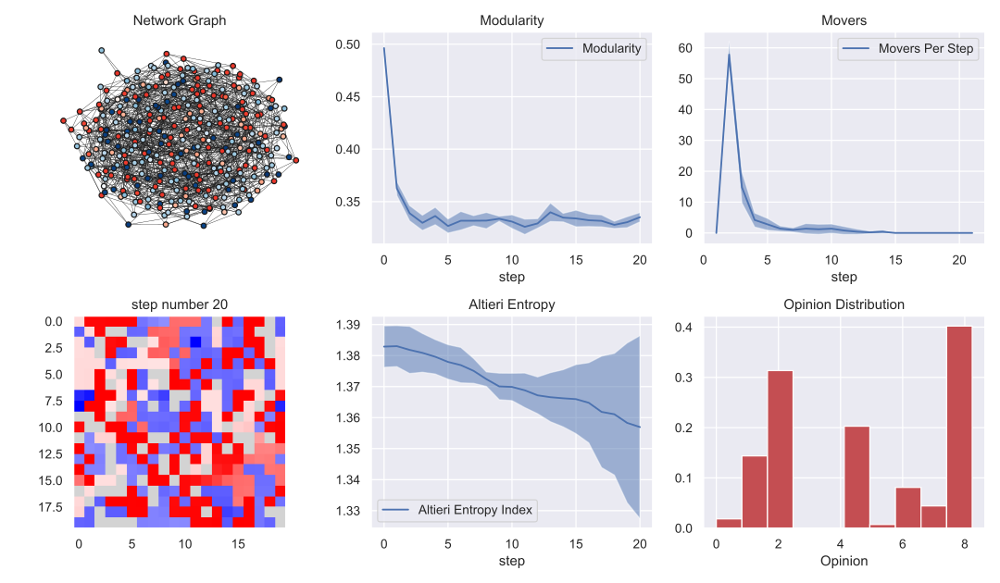

# Welcome to the Repository for Agent-Based Modeling Project by Group 9

## Team Members
- He Liu (14859017)
- Qi Zhang (14813068)
- Ziya Alim Sungqar (14904950)
- Ravi Sharma Kaushik (14332744)

## Project Overview
This project focuses on understanding the dynamics of opinion polarization where individuals are influenced by their social and spatial neighbors. Our primary goals were to observe polarization in a society with dual opinions and to test strategies to mitigate polarization.


(https://github.com/Koekoek1337/ABM9-Polarization/blob/nm_Kaushik/figures/without0.8_0.5_20.png)


## Installation Instructions
To install necessary dependencies, run the following command using pip:
```
$ pip install -r requirements.txt
```
Ensure Graphviz is installed by following these steps:
1. Download `Graphviz` from [this link](https://gitlab.com/api/v4/projects/4207231/packages/generic/graphviz-releases/11.0.0/windows_10_cmake_Release_graphviz-install-11.0.0-win64.exe).
2. Install Graphviz to the default directory (usually C:\Programs).
3. Navigate to the 'bin' folder within the installation directory, copy its path, and add it to your system's environment variables.
4. Restart your computer to apply the changes.

Note: Use Python 3.9! The `spatialentropy` package doesn't work in Python 3.11
## Running the Model
To run the model interactively:
```
$ python3 -m polarization.core.run
```

This command launches a browser-based visualization showing a spatial grid of agents with opinions indicated by a color spectrum from Blue (0) to Red (10).

## Repository Structure
- **data/**: Contains data from sensitivity analysis.
- **figures/**: Holds all figures from tests and analysis.
- **polarization/**:
  - **core/**:
    - `model.py`: Defines the model and agent classes.
    - `plot_graph.py`: Functions for plotting the social network graph.
    - `plot_grid.py`: Functions for visualizing agents on a grid.
    - `run.py`: Starts the model visualization server.
    - `server.py`: Server setup for browser-based visualization.
    - `util.py`: Contains various utilities used throughout the project.
  - **experiments/**:
    - `experiment_run.py`: Functions for plotting experiment data.
    - `experiments.py`: Manages experiment execution and result generation.
  - **sensitivityanalysis/**:
    - `batch_run.py`: Conducts Sobol Sensitivity Analysis using FixedBatchRunner.
    - `ofatsa.ipynb`: Jupyter notebook for OFAT Sensitivity Analysis.
    - `sobol_plot.py`: Plots results from Sobol Sensitivity Analysis.
  - **mesa_fix/**:
    - `batchrunner.py`: Modified Mesa batchrunner to support multiprocessing.

